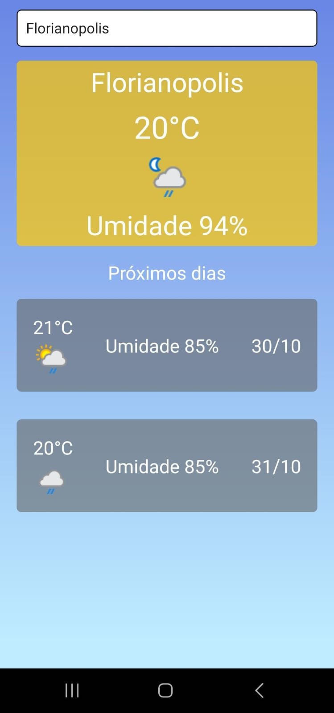

# 🌦️ Bry WeatherApp


## 📱 **Screenshots**



---

## 🧪 **Devices testados**
- Samsung S20FE ✅
- Android emulator APK 33 ✅
- IOS Device ❌

## 🛠️ **Bibliotecas Utilizadas**

### **Bibliotecas Principais**

- **Expo**: Plataforma de desenvolvimento que facilita a criação e deploy de apps em React Native.
- **Expo Router**: Gerenciamento de navegação baseado em rotas.

### **Gerenciamento de Estado e Hooks**

- **Context API do React**: Gerencia o estado global (como a cidade buscada).
- **Hooks Customizados**: Encapsulam lógicas complexas, como busca e manipulação de localização.

### **Armazenamento e Rede**

- **AsyncStorage**: Armazena dados localmente.
- **Expo Location**: Acessa a localização do dispositivo.

### **CI/CD e Testes**

- **Expo EAS**: Serviço de construção e deploy na nuvem.
- **GitHub Actions**: Pipeline de CI/CD para automação de testes e builds.
- **Jest**: Testes unitários.
- **Maestro**: Testes end-to-end (E2E).

---

## 📦 **Instalação e Configuração**

### **Pré-requisitos**

Certifique-se de ter as seguintes ferramentas instaladas:

- **Node.js** (v20.18.0 ou superior)
- **npm** ou **yarn** para gerenciamento de pacotes
- **git**
- **Expo CLI**:

  ```bash
  npm install -g expo-cli
  ```

- **Maestro** (para testes E2E):

    [Instale conforme o seu sistema operacional](https://maestro.mobile.dev/getting-started/installing-maestro)


- **Android Studio** ou **Xcode** para emuladores (opcional).

---

## 🛠️ **Como Executar o Projeto**

1. **Clone o repositório**:

   ```bash
   git clone https://github.com/sealove20/bry-weather-app.git
   cd bry-weather-app
   ```

2. **Instale as dependências**:

   ```bash
   npm install
   ```

3. **Adicione sua chave de API do clima**:
   A chave pode ser gerada aqui **https://www.weatherapi.com/**

   Crie um arquivo `.env` na raiz do projeto:

   ```
   cp .env.example .env

   ```
   adicione sua chave no arquivo `.env`

    ```
   EXPO_PUBLIC_API_KEY=sua-chave-de-api
   ```

5. **Execute o aplicativo no emulador ou dispositivo físico**:

     ```bash
     npm run start
     ```

6. **Execute os testes localmente**:

   - **Testes unitários** com Jest:

     ```bash
     npm test
     ```

   - **Testes E2E** com Maestro:
     Para rodar os testes E2E é necessário estar com o emulador aberto.
     ```bash
     maestro test maestro/basic-flow.yaml
     ```

7. **Execute o Build com EAS**:

   ```bash
   eas build --platform android --profile preview
   ```
   
8. **Coverage**
   ```bash
   npm run coverage
   ```
---

## 🔄 **Executando o Pipeline de CI/CD**

O projeto inclui um workflow do **GitHub Actions** para automação de testes e builds.

1. **Adicione seu token do Expo** aos **secrets** do GitHub:

   - Vá para **Settings** > **Secrets and variables** > **Actions**.
   - Adicione um novo secret com a chave: `EXPO_TOKEN` e o valor do token do Expo.

2. **Execute o pipeline**:
   - Envie código para o branch `main` ou abra um **pull request** direcionado para `main`.
   - O pipeline irá automaticamente:
     1. Instalar dependências.
     2. Executar testes.
     3. Construir o app com EAS.

---


=) ❤️
